# Behavioral Cloning Project

The objective with this project is train a convolutional neural network to map raw pixels to steering commands so that it can be used to autonomously drive a car around a simulated track. 

The data that will be used to train the network will be video recordings of a human controlling the car around the track in the simulator. The end objective is to create a CNN that is able to autonomously navigate the track. To get an idea take a look at the image of the simulator below.

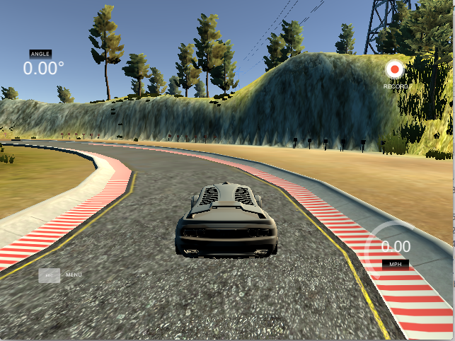


## Data Exploration

Sample data has been provided by Udacity. This is made up of image files and a corresponding csv file that maps the image file to the corresponding steering label.


```python
import cv2
import matplotlib.pyplot as plt
import matplotlib.gridspec as gridspec
import matplotlib.image as mpimg
import numpy as np
import pandas as pd
import os
import scipy.ndimage as ndi
import scipy.misc as spm
%matplotlib inline
```


```python
# path to csv file that maps images to steering angle.
csv_map = 'driving_log.csv'

# lets take a look at what the csv file looks like
driving_log = pd.read_csv(csv_map)
driving_log['left'] = driving_log['left'].str.strip()
driving_log['right'] = driving_log['right'].str.strip()
driving_log['center'] = driving_log['center'].str.strip()
driving_log[:10]
```


<div>
<table border="1" class="dataframe">
  <thead>
    <tr style="text-align: right;">
      <th></th>
      <th>center</th>
      <th>left</th>
      <th>right</th>
      <th>steering</th>
      <th>throttle</th>
      <th>brake</th>
      <th>speed</th>
    </tr>
  </thead>
  <tbody>
    <tr>
      <th>0</th>
      <td>IMG/center_2016_12_01_13_30_48_287.jpg</td>
      <td>IMG/left_2016_12_01_13_30_48_287.jpg</td>
      <td>IMG/right_2016_12_01_13_30_48_287.jpg</td>
      <td>0.0</td>
      <td>0.0</td>
      <td>0.0</td>
      <td>22.148290</td>
    </tr>
    <tr>
      <th>1</th>
      <td>IMG/center_2016_12_01_13_30_48_404.jpg</td>
      <td>IMG/left_2016_12_01_13_30_48_404.jpg</td>
      <td>IMG/right_2016_12_01_13_30_48_404.jpg</td>
      <td>0.0</td>
      <td>0.0</td>
      <td>0.0</td>
      <td>21.879630</td>
    </tr>
    <tr>
      <th>2</th>
      <td>IMG/center_2016_12_01_13_31_12_937.jpg</td>
      <td>IMG/left_2016_12_01_13_31_12_937.jpg</td>
      <td>IMG/right_2016_12_01_13_31_12_937.jpg</td>
      <td>0.0</td>
      <td>0.0</td>
      <td>0.0</td>
      <td>1.453011</td>
    </tr>
    <tr>
      <th>3</th>
      <td>IMG/center_2016_12_01_13_31_13_037.jpg</td>
      <td>IMG/left_2016_12_01_13_31_13_037.jpg</td>
      <td>IMG/right_2016_12_01_13_31_13_037.jpg</td>
      <td>0.0</td>
      <td>0.0</td>
      <td>0.0</td>
      <td>1.438419</td>
    </tr>
    <tr>
      <th>4</th>
      <td>IMG/center_2016_12_01_13_31_13_177.jpg</td>
      <td>IMG/left_2016_12_01_13_31_13_177.jpg</td>
      <td>IMG/right_2016_12_01_13_31_13_177.jpg</td>
      <td>0.0</td>
      <td>0.0</td>
      <td>0.0</td>
      <td>1.418236</td>
    </tr>
    <tr>
      <th>5</th>
      <td>IMG/center_2016_12_01_13_31_13_279.jpg</td>
      <td>IMG/left_2016_12_01_13_31_13_279.jpg</td>
      <td>IMG/right_2016_12_01_13_31_13_279.jpg</td>
      <td>0.0</td>
      <td>0.0</td>
      <td>0.0</td>
      <td>1.403993</td>
    </tr>
    <tr>
      <th>6</th>
      <td>IMG/center_2016_12_01_13_31_13_381.jpg</td>
      <td>IMG/left_2016_12_01_13_31_13_381.jpg</td>
      <td>IMG/right_2016_12_01_13_31_13_381.jpg</td>
      <td>0.0</td>
      <td>0.0</td>
      <td>0.0</td>
      <td>1.389892</td>
    </tr>
    <tr>
      <th>7</th>
      <td>IMG/center_2016_12_01_13_31_13_482.jpg</td>
      <td>IMG/left_2016_12_01_13_31_13_482.jpg</td>
      <td>IMG/right_2016_12_01_13_31_13_482.jpg</td>
      <td>0.0</td>
      <td>0.0</td>
      <td>0.0</td>
      <td>1.375934</td>
    </tr>
    <tr>
      <th>8</th>
      <td>IMG/center_2016_12_01_13_31_13_584.jpg</td>
      <td>IMG/left_2016_12_01_13_31_13_584.jpg</td>
      <td>IMG/right_2016_12_01_13_31_13_584.jpg</td>
      <td>0.0</td>
      <td>0.0</td>
      <td>0.0</td>
      <td>1.362115</td>
    </tr>
    <tr>
      <th>9</th>
      <td>IMG/center_2016_12_01_13_31_13_686.jpg</td>
      <td>IMG/left_2016_12_01_13_31_13_686.jpg</td>
      <td>IMG/right_2016_12_01_13_31_13_686.jpg</td>
      <td>0.0</td>
      <td>0.0</td>
      <td>0.0</td>
      <td>1.348435</td>
    </tr>
  </tbody>
</table>
</div>


The csv file is composed of three image entries (right, center, left), steering angle, throttle, brake, and speed. Lets now take a look at a single data point.


```python
plt.close('all')

n_col = 3
n_row = 10

center_images = [mpimg.imread(img) for img in driving_log['center'][:n_row]]
left_images = [mpimg.imread(img) for img in driving_log['left'][:n_row]]
right_images = [mpimg.imread(img) for img in driving_log['right'][:n_row]]

gs = gridspec.GridSpec(ncols=n_col, nrows=n_row)
gs.update(hspace=0.02, wspace=0.02)
fig = plt.figure(figsize=(15,15))
for row_idx, plot_idx in enumerate(range(0,n_col*n_row,n_col)):
    # left image
    ax1 = plt.subplot(gs[plot_idx])
    ax1.imshow(left_images[row_idx])
    ax1.axis('off')
    # center image
    ax2 = plt.subplot(gs[plot_idx+1])
    ax2.imshow(center_images[row_idx])
    ax2.axis('off')
    # right iamge
    ax3 = plt.subplot(gs[plot_idx+2])
    ax3.imshow(right_images[row_idx])
    ax3.axis('off')
```


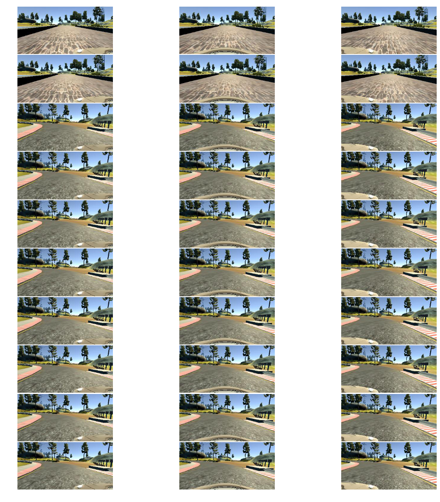


Is the sample data set entirely composed of centerline driving? I am trying to figure out how much variability there is in the data.


```python
plt.close('all')

driving_log['steering'].plot.hist(bins=100)
min_idx, max_idx = driving_log['steering'].idxmin(), driving_log['steering'].idxmax()
print("Minimum Steering Angle: {}".format(driving_log['steering'][min_idx]))
print("Maximum Steering Angle: {}".format(driving_log['steering'][max_idx]))

# lets look at the images that correspond to those extreme steering angles.
left, center, right = \
    driving_log['left'][min_idx], driving_log['center'][min_idx], driving_log['right'][min_idx]

fig1, (ax1, ax2, ax3) = plt.subplots(1,3)
ax1.imshow(mpimg.imread(left))
ax1.axis('off')
ax2.imshow(mpimg.imread(center))
ax2.axis('off')
ax3.imshow(mpimg.imread(right))
ax3.axis('off')
fig1.set_figheight(15)
fig1.set_figwidth(15)

left, center, right = \
    driving_log['left'][max_idx], driving_log['center'][max_idx], driving_log['right'][max_idx]

fig2, (ax4, ax5, ax6) = plt.subplots(1,3)
ax4.imshow(mpimg.imread(left))
ax4.axis('off')
ax5.imshow(mpimg.imread(center))
ax5.axis('off')
ax6.imshow(mpimg.imread(right))
ax6.axis('off')
fig2.set_figheight(15)
fig2.set_figwidth(15)
```

    Minimum Steering Angle: -0.9426954
    Maximum Steering Angle: 1.0


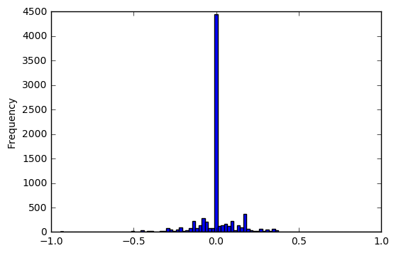


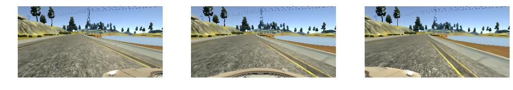


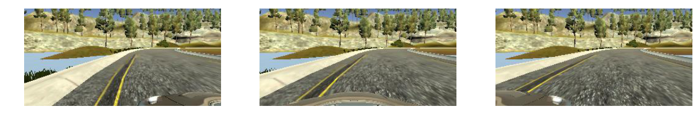


Looking at the histogram it is clear that the majority of the data is center lane driving. There are a couple thousand non-center lane driving examples which is convenient.

**Data Augmentation Ideas**:

- Horizontal flip (right becomes left) with sign change on steering angle. A flipped image changes a right turn into a left turn!
- Translate the images vertically and horizontally. Need to update steering angle proportionally with horizontal shift. Since it is effectively shifting the car away from the center lane.
- Determine offset value to apply to left and right frames.


```python
plt.close('all')

img_c = mpimg.imread(center)
img_l = mpimg.imread(left)
img_r = mpimg.imread(right)

fig, (ax1, ax2, ax3) = plt.subplots(1,3)
ax1.imshow(img_l)
ax2.imshow(img_c)
ax3.imshow(img_r)
fig.set_figheight(15)
fig.set_figwidth(15)
fig.tight_layout()
```


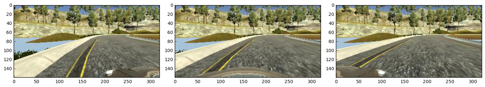


```python
# borrowed from Vivek Yadav (https://github.com/vxy10/ImageAugmentation)
def augment_brightness_camera_images(image):
    image1 = cv2.cvtColor(image,cv2.COLOR_RGB2HSV)
    random_bright = .25+np.random.uniform()
    image1[:,:,2] = image1[:,:,2]*random_bright
    image1 = cv2.cvtColor(image1,cv2.COLOR_HSV2RGB)
    return image1

def resize_image(x, size):
    """Down-sample image to size."""
    return spm.imresize(x, size=size)

def crop_out_car(x, y_range):
    rows, columns, channels = x.shape
    return x[y_range:rows-y_range,:,:]

def flip_axis(x, axis):
    """Flip image about specified axis."""
    x = np.asarray(x).swapaxes(axis, 0)
    x = x[::-1, ...]
    x = x.swapaxes(0, axis)
    steering_adjustment = -1
    return x, steering_adjustment

# translate image horizontally.
def translate_image(image, x_range, y_range):
    dx = x_range*np.random.uniform()-x_range/2.
    dy = y_range*np.random.uniform()-y_range/2.
    t_matrix = np.array([[1,0,dx],[0,1,dy]], dtype=np.float64)
    # adjust steering angle by 0.2 radians per pixel
    steering_adjustment = dx/x_range*2*.2
    return cv2.warpAffine(image,t_matrix,(image.shape[1],image.shape[0])), steering_adjustment

img = mpimg.imread(driving_log['right'].iloc[0])

plt.close('all')

fig = plt.figure(figsize=(4,4))
plt.imshow(resize_image(img, size=(64,64,3)))
plt.title("Resize Example")

fig = plt.figure(figsize=(8,4))
plt.imshow(crop_out_car(img, 25))
plt.title("Crop Example")
```


    <matplotlib.text.Text at 0x7f6733b7a940>


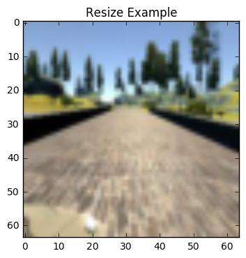


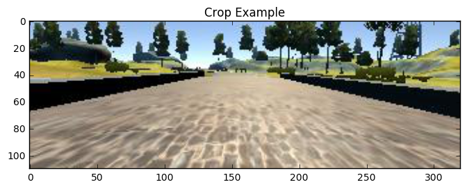


```python
plt.close('all')

fig, axes = plt.subplots(5,5, figsize=(16,8))
fig.suptitle("Brightness Augmentation Examples", fontsize=14)
for i in range(5):
    for ii in range(5):
        axes[i,ii].imshow(augment_brightness_camera_images(img))
        axes[i,ii].axis('off')

fig, axes = plt.subplots(5,5, figsize=(16,8))
fig.suptitle("Horizontal Flip Examples", fontsize=14)
for i in range(5):
    for ii in range(5):
        axes[i,ii].imshow(flip_axis(img, 1)[0])
        axes[i,ii].axis('off')

fig, axes = plt.subplots(5,5, figsize=(16,8))
fig.suptitle("Translation Examples", fontsize=14)
for i in range(5):
    for ii in range(5):
        axes[i,ii].imshow(translate_image(img, 50, 50)[0])
        axes[i,ii].axis('off')
```


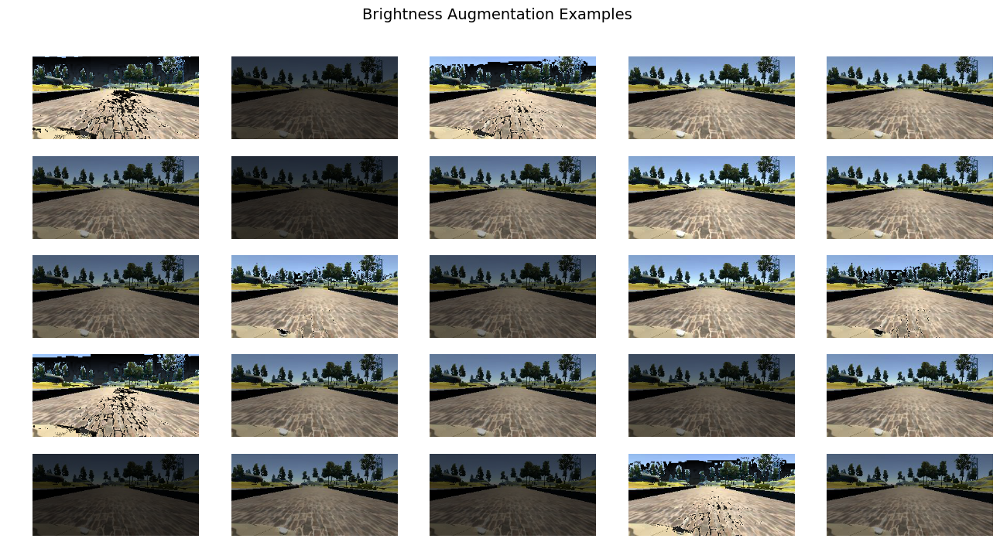


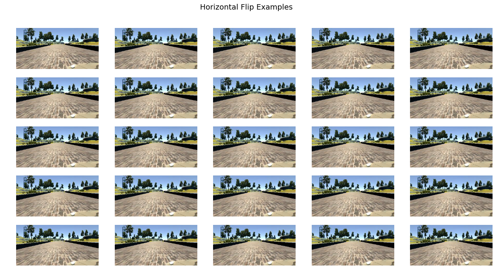


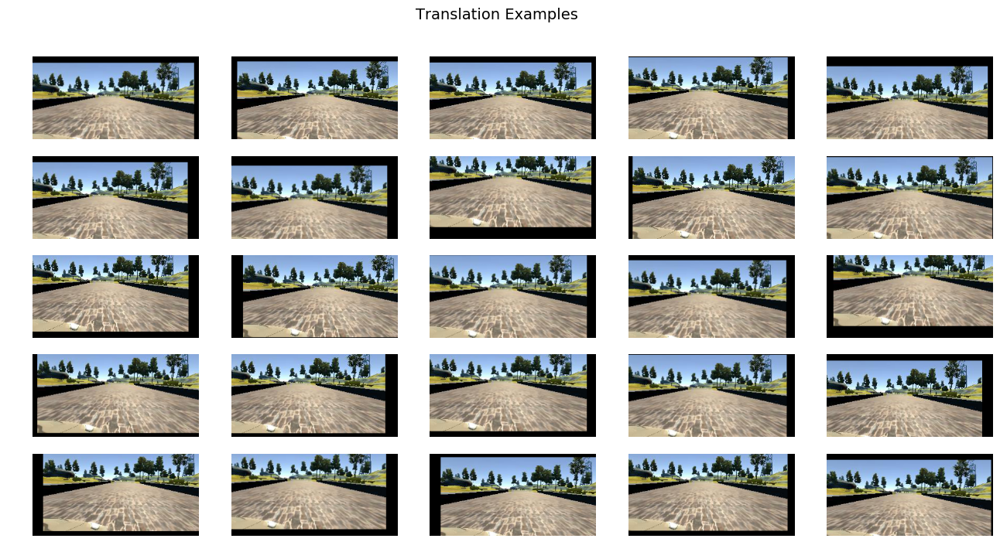


Given the random transformation method that was borrowed from keras and modified, the data is almost ready to be fed into a neural network. Before doing this I want to determine the linear mapping for the left and right camera perspectives. Here is the equation that will be used for the left and right steering angle given the center steering angle as input.

$$left = center + offset$$
$$right = center - offset$$

From looking at the image a negative steering angle corresponds to turning left and a positive steering angle corresponds to steering right.

## Preprocessing and Data Augmentation Pipeline

The objective now is to create a generator that will randomly select images from the dataset, allocate a portion to be used for validation, and augment the training data.

Pipeline:

1. Randomly select image from left, center and right.
2. Apply offset to steering if left or right.
3. Augment bright ness of image.
4. Translate image 20 pixels horizontally, 10 pixels vertically.
5. Crop the car out of the image.
6. Resize the image to (64,64,3)
7. Randomly flip image.
8. Returns image and steering angle.


```python
def preprocess_image(log_entry, train=False):
    """
    Preprocess procedure.
    
    Training Routine:
    
    1. Randomly choose perspective (left, center, right)
    2. Read corresponding image and steering angle.
    3. Apply steering angle offset if left or right perspective.
    4. Augment brightness of image.
    5. Translate image in x and y.
    6. Flip image about y axis.
    7. Crop out car.
    8. Resize image.
    
    Non-Training Routine:
    
    1. Read center image and steering angle.
    2. Crop out car.
    3. Resize image.
    
    Args:
        log_entry (DataFrame): driving_log.csv row
        train (bool): turn on data augmentation
        
    Returns:
        (image, steering angle)
    """
    perspective = 'center'
    
    if train:
        # randomly choose which camera to use.
        perspective = ['center', 'right', 'left'][np.random.randint(3)]
    
    # read chosen image and steering angle.
    img, steer_angle = \
        mpimg.imread(log_entry[perspective]), log_entry['steering']
            
    # adjust steering angle to account for viepoint shift.
    if perspective == 'right':
        steer_angle -= 0.25
    elif perspective == 'left':
        steer_angle += 0.25
    
    if train:
        
        # augment the brightness of the image
        img = augment_brightness_camera_images(img)

        # translate the image in x and y
        img, steer_offset  = translate_image(img, 20, 10)
        steer_angle += steer_offset

        # randomly flip image
        if np.random.randint(2):
            img, steer_sign = flip_axis(img, 1)
            steer_angle *= steer_sign
    
    # crop the car out of the image.
    img = crop_out_car(img, 25)
    
    # resize image
    img = resize_image(img, size=(64,64,3))
    
    return img, steer_angle

fig, axes = plt.subplots(5,5, figsize=(16,8))
fig.suptitle("Preprocess (Non-Training) Examples", fontsize=14)
for i in range(5):
    for ii in range(5):
        img, angle = preprocess_image(driving_log.iloc[0], train=False)
        axes[i,ii].imshow(img)
        axes[i,ii].set_title("{}".format(np.round(angle, 2)))
        axes[i,ii].axis('off')
        
fig, axes = plt.subplots(5,5, figsize=(16,8))
fig.suptitle("Preprocess Training Examples", fontsize=14)
for i in range(5):
    for ii in range(5):
        img, angle = preprocess_image(driving_log.iloc[0], train=True)
        axes[i,ii].imshow(img)
        axes[i,ii].set_title("{}".format(np.round(angle, 2)))
        axes[i,ii].axis('off')
```


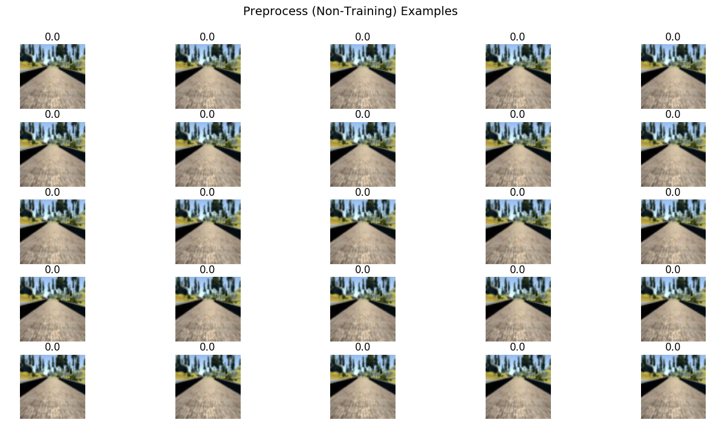


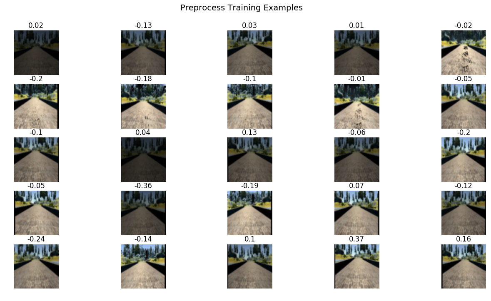


## Data Generators

Now that the preprocessing routine has been defined it is time to create a python generator for generating training data and validation data. The training data will have the train flag turned on.


```python
def data_and_label_generator(batch_size=128, train=False):
    # read driving_log.csv into dataframe
    data = pd.read_csv('driving_log.csv')
    
    # remove spaces in files names
    data['center'] = data['center'].str.strip()
    data['right'] = data['right'].str.strip()
    data['left'] = data['left'].str.strip()
    
    while True:
        # containers for images and labels
        images = list()
        labels = list()
        
        # randomly select entries from drive_log.csv
        rnd_idx = np.random.randint(0, len(data), size=(batch_size,))
        random_selection = data.iloc[rnd_idx]
        
        for i in range(batch_size):
            image, angle = preprocess_image(random_selection.iloc[i], train)
            images.append(image)
            labels.append(angle)
        
        yield np.array(images, dtype=np.float32), np.array(labels, np.float32)
        
training_generator = data_and_label_generator(batch_size=10, train=True)
validation_generator = data_and_label_generator(batch_size=10, train=False)

plt.close('all')

images, angles = next(training_generator)
fig, axes = plt.subplots(2,5, figsize=(16,8))
fig.suptitle("Training Generator", fontsize=14)
for i in range(2):
    for ii in range(5):
        img, angle = preprocess_image(driving_log.iloc[0], train=True)
        axes[i,ii].imshow(images[i*5+ii].astype(np.uint8))
        axes[i,ii].set_title("{}".format(np.round(angle, 2)))
        axes[i,ii].axis('off')
        
images, angles = next(validation_generator)
fig, axes = plt.subplots(2,5, figsize=(16,8))
fig.suptitle("Validation Generator", fontsize=14)
for i in range(2):
    for ii in range(5):
        img, angle = preprocess_image(driving_log.iloc[0], train=True)
        axes[i,ii].imshow(images[i*5+ii].astype(np.uint8))
        axes[i,ii].set_title("{}".format(np.round(angle, 2)))

        axes[i,ii].axis('off')
```


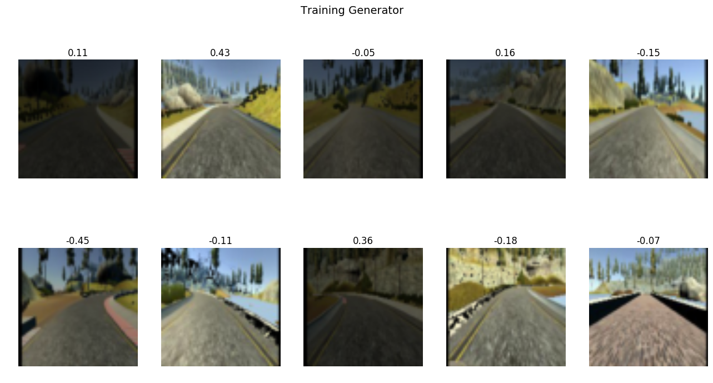


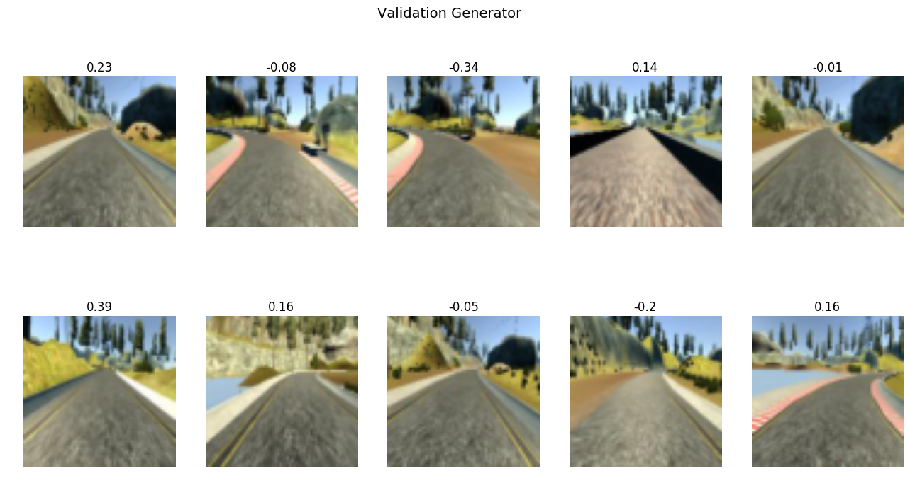


## Network Architecture

Now that we have the data generation figured out it is time to build the neural network and define the loss function. The network I am going to try is a slightly modified version of the one NVIDIA employed.

Layers:

1. Normalization
2. Conv  3@1x1
3. Conv 24@3x3
4. Conv 36@3x3
5. Conv 48@3x3
6. Conv 64@3x3
7. Conv 64@3x3
8. Dense 100
9. Dense 50
10. Dense 1

Using ELU for activations because they are supposed to be better than RELUs. I have yet to read the paper so I am taking it purely on word of mouth at the moment. Here is the general though process behind the layering. The first convolutional layer is there to allow the model to select the optimal color space for feature discovery. The four layers convolutional layers are there to identify increasingly complex features. The three fully connected layers translate the features discovered by the convolutional neural networks to the steering angle command.


```python
import keras
from keras.models import Sequential
import keras.layers as layers

# input image dimensions
image_height = 64
image_width = 64

# NVIDIA network modified to use ELU and a 1x1 convolution layer.
model = Sequential()
model.add(layers.Lambda(lambda x: x/255.-0.5, input_shape=(image_height,image_width,3)))
model.add(layers.Conv2D(3, 1, 1, border_mode='valid', name='conv0'))
model.add(layers.Conv2D(24, 3, 3, border_mode='valid', name='conv1'))
model.add(layers.ELU())
model.add(layers.Conv2D(36, 3, 3, border_mode='valid', name='conv2'))
model.add(layers.ELU())
model.add(layers.Conv2D(48, 3, 3, border_mode='valid', name='conv3'))
model.add(layers.ELU())
model.add(layers.Conv2D(64, 3, 3, border_mode='valid', name='conv4'))
model.add(layers.ELU())
model.add(layers.Conv2D(64, 3, 3, border_mode='valid', name='conv5'))
model.add(layers.ELU())
model.add(layers.Flatten())
model.add(layers.Dense(100))
model.add(layers.ELU())
model.add(layers.Dense(50))
model.add(layers.ELU())
model.add(layers.Dense(10))
model.add(layers.ELU())
model.add(layers.Dense(1))

model.compile(loss='mse', optimizer='adam')
```

    Using TensorFlow backend.


```python
t_gen = data_and_label_generator(batch_size=32, train=True)
v_gen = data_and_label_generator(batch_size=32, train=False)

model.fit_generator(generator=t_gen, 
                    samples_per_epoch=10000, 
                    nb_epoch=5, 
                    validation_data=v_gen, 
                    nb_val_samples=2000)

model.save_weights('model.h5')
with open("model.json", 'w') as f:
    f.write(model.to_json())
print("Model Saved!")
```

    Epoch 1/5
     9984/10000 [============================>.] - ETA: 0s - loss: 0.1009

    /home/charlie/anaconda3/lib/python3.5/site-packages/keras/engine/training.py:1480: UserWarning: Epoch comprised more than `samples_per_epoch` samples, which might affect learning results. Set `samples_per_epoch` correctly to avoid this warning.
      warnings.warn('Epoch comprised more than '


    10016/10000 [==============================] - 62s - loss: 0.1007 - val_loss: 0.0407
    Epoch 2/5
    10016/10000 [==============================] - 61s - loss: 0.0491 - val_loss: 0.0354
    Epoch 3/5
    10016/10000 [==============================] - 63s - loss: 0.0410 - val_loss: 0.0436
    Epoch 4/5
    10016/10000 [==============================] - 61s - loss: 0.0351 - val_loss: 0.0190
    Epoch 5/5
    10016/10000 [==============================] - 62s - loss: 0.0347 - val_loss: 0.0302
    Model Saved!


## Results

After some experimentation it looks like I got lucky with my initial training parameters. 

- 5 epochs of 10,000 samples
- batch size of 32

The model trained with just these parameters is capable of driving the majority of track 1 with two hiccups. The sharp turn where it looks like a dirt road is going out to the right and the following sharp turn to the right. I am trying to generate some example data for how to handle those corners but getting the simulator to output a smooth steering angle is proving to be very challenging since the smallest touch to my controller or mouse results in the steering angle saturating. I haven't give up hope yet though.  

I did try training the model with the following parameters:

- 5 epochs of 40,000 samples

That was enough for the model to seriously overfit and become useful. There is definitely a balance between generalization and overfitting for this problem. The approach that seems to work the best is to train your model incremently over time and save the intermediate states.
